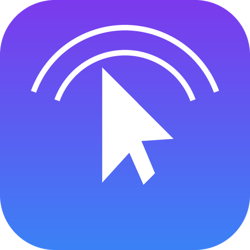

# AeroTouch

Turn an Android phone into a high-precision wireless motion mouse for
Windows, macOS, and Linux. Move the phone to steer the cursor with real IMU
sensor fusion; touch the screen only for clicks, drags, scrolling, and
navigation.



---

## Contents

- [How it works](#how-it-works)
- [Project structure](#project-structure)
- [Getting started](#getting-started)
- [Testing the full loop (reference desktop receiver)](#testing-the-full-loop-reference-desktop-receiver)
- [The wire protocol](#the-wire-protocol)
- [Configuration & tuning](#configuration--tuning)
- [Architecture notes](#architecture-notes)
- [Running the tests](#running-the-tests)
- [Troubleshooting](#troubleshooting)

---

## How it works

- **Motion Engine** (`lib/core/motion`) reads the gyroscope and accelerometer
  at 100Hz, fuses them with a complementary filter, learns the gyroscope's
  zero-rate bias whenever the phone is at rest (so the cursor never drifts
  while sitting still), applies an adaptive dead zone, a configurable
  acceleration curve, and exponential smoothing (which also produces a
  natural deceleration as motion stops).
- **Smart Clutch**: cursor deltas are only ever emitted while a finger is
  touching the screen. Lift every finger and the cursor freezes in place -
  exactly like lifting a physical mouse off the desk to reposition your hand.
  Touch back down and it resumes instantly, with no jump.
- **Gesture Recognizer** (`lib/features/mouse_control/presentation/controllers/gesture_recognizer.dart`)
  is a pure-Dart, unit-tested state machine that turns raw multi-touch
  pointer events into clicks, drags, scrolls, and navigation gestures - see
  the [gesture table](#the-wire-protocol) below.
- **Connection** streams JSON commands to the desktop over a WebSocket, with
  a 2-second ping/pong heartbeat that doubles as the latency measurement,
  automatic exponential-backoff reconnect, and UDP broadcast discovery so you
  never have to type an IP address by hand.

## Project structure

The app follows Clean Architecture with one folder per feature, each split
into `domain` (entities, repository interfaces, use cases - no Flutter
imports), `data` (datasources, models, repository implementations), and
`presentation` (Riverpod controllers, pages, widgets):

```
lib/
  core/                      # Cross-feature building blocks (never imports a feature)
    constants/               # AppConstants - every tunable timing/port/threshold, named
    theme/                   # Colors, gradients, type scale, the Material 3 ThemeData
    utils/                   # Result<T> (a tiny Either-style type), no external deps
    error/                   # Failure / Exception hierarchies
    services/                # HapticsService, BatteryService
    widgets/                 # GlassContainer, GlassCard, GradientButton, ...
    motion/                  # MotionEngine + ComplementaryFilter (the sensor fusion core)
    di/                      # Root Riverpod providers (e.g. SharedPreferences)
  features/
    connection/              # WebSocket link, UDP discovery, ConnectionInfo aggregation
    settings/                # AppSettings, persisted via SharedPreferences
    mouse_control/           # MouseCommand protocol, GestureRecognizer, Mouse Mode UI
    home/                    # Home screen (status, stats, Connect / Start Mouse Mode)
    about/                   # About screen
    shell/                   # RootShell: bottom-nav composition root
  app.dart                   # MaterialApp + theme wiring
  main.dart                  # Entry point: boots SharedPreferences, then ProviderScope
test/                        # Unit tests for the motion engine, gesture recognizer, settings
tools/server/                # OPTIONAL reference desktop receiver (Python), see below
android/                     # Android platform project (this app targets Android only)
```

State management is [Riverpod 3](https://riverpod.dev) using the modern
`Notifier`/`NotifierProvider` API (no code generation, no `build_runner`
required - every provider is hand-written and explicit). Dependency
injection is just Riverpod's provider graph: every datasource, repository,
and use case is constructed in a `Provider`, so swapping an implementation
(e.g. for tests) is a one-line `overrideWith`.

## Getting started

**Prerequisites:** Flutter 3.27 or newer (`flutter --version`), an Android
device or emulator with a gyroscope and accelerometer (most emulators don't
simulate these convincingly - a real phone is strongly recommended).

```bash
# 1. Unzip/clone the project, then from its root:
flutter create . --platforms=android   # safe: fills in any platform files
                                        # your installed Flutter SDK needs
                                        # (notably the Gradle wrapper JAR,
                                        # which is a binary file and can't be
                                        # shipped in source form) without
                                        # touching lib/, pubspec.yaml, or the
                                        # android/ files already provided.

# 2. Fetch packages
flutter pub get

# 3. Run on a connected Android device
flutter run
```

To build a release APK:

```bash
flutter build apk --release
```

> **Note:** step 1 is only needed once, the first time you set the project
> up, so that Gradle has a wrapper JAR to run. If your Flutter SDK already
> populated `android/gradlew` for you, you can skip it.

## Testing the full loop (reference desktop receiver)

AeroTouch is a phone app; it needs something on the PC side to actually move
your mouse. `tools/server/aerotouch_server.py` is a small, optional reference
implementation of that receiver - **not** part of the Flutter app - good
enough to test the whole system end-to-end on Windows, macOS, or Linux:

```bash
cd tools/server
pip install -r requirements.txt
python aerotouch_server.py
```

It answers AeroTouch's UDP discovery broadcasts and drives the real
mouse/keyboard via [`pyautogui`](https://pyautogui.readthedocs.io/) for every
message type in the protocol below, including a `ping` → `pong` heartbeat
reply for latency reporting. Once it's running, open AeroTouch on your
phone (same Wi-Fi network), tap **Connect**, and pick your computer from the
list.

## The wire protocol

Every message is a single-line JSON object over the WebSocket
(`ws://<ip>:58712` by default). Motion is sent continuously while the Smart
Clutch is engaged; every other message is sent once per resolved gesture.

| Gesture | Message |
|---|---|
| Phone movement (clutch engaged) | `{"type":"motion","dx":3.2,"dy":-1.4}` |
| Single tap | `{"type":"leftClick"}` |
| Double tap | `{"type":"doubleClick"}` |
| Two-finger tap | `{"type":"rightClick"}` |
| Long press | `{"type":"leftButtonDown"}` |
| Long press + move | *(motion continues; button stays down)* |
| Release after long press | `{"type":"leftButtonUp"}` |
| Two-finger vertical swipe | `{"type":"scroll","dy":-12.0,"dx":0.0}` |
| Three-finger swipe left | `{"type":"back"}` |
| Three-finger swipe right | `{"type":"forward"}` |
| Pinch | `{"type":"zoom","delta":0.08}` |
| Heartbeat (every 2s) | `{"type":"ping","ts":1737000000000}` → receiver replies `{"type":"pong","ts":1737000000000}` |

LAN discovery is a tiny UDP exchange on port `58008`:
AeroTouch broadcasts `{"type":"aerotouch_discover"}`, and any receiver on the
network replies `{"type":"aerotouch_announce","name":"...","port":58712}`.

## Configuration & tuning

Everything on the Settings screen is persisted immediately to
`SharedPreferences` and takes effect on the next sensor sample - no restart
needed:

- **Sensitivity** (0.1x–3.0x) - overall pointer speed multiplier.
- **Dead Zone** (0–100%) - how much hand tremor is ignored before the
  cursor starts moving.
- **Pointer Acceleration** (1.0x–3.0x) - exponent on motion magnitude; higher
  keeps slow movements precise while fast flicks travel further.
- **Pointer Smoothing** (0–95%) - one-pole low-pass filter strength.
- **Invert X / Invert Y** - flip either axis for different phone grips.
- **Left-Handed Mode** - swaps which tap sends left vs. right click,
  mirroring the primary/secondary button swap on physical left-handed mice.
- **Dark Mode** - toggles between a pure-black (AMOLED) canvas and a
  slightly-lifted "twilight" canvas; both stay dark by design.
- **Reconnect Automatically** - exponential-backoff auto-reconnect if the
  link drops mid-session.

## Architecture notes

- **`Result<T>`** (`core/utils/result.dart`) is a tiny, dependency-free
  Either-style type used by every repository instead of throwing, so
  failures are always explicitly handled at the call site.
- **Cross-feature wiring** (e.g. mirroring the "Reconnect automatically"
  setting onto the connection repository) deliberately lives in
  `features/shell/presentation/root_shell.dart` - the composition root -
  rather than inside either the `settings` or `connection` feature, so
  neither feature depends on the other.
- **`MotionConfig`** (`core/motion/motion_models.dart`) is a small,
  feature-agnostic value type. `core/` never imports from `features/`; the
  `mouse_control` feature maps `AppSettings` → `MotionConfig` at the point of
  use, keeping the dependency direction one-way (features depend on core,
  never the reverse).
- **`sensors_plus`** is the only place the app talks to the IMU; everything
  downstream of `_onGyroscope`/`_onAccelerometer` in `MotionEngine` is plain,
  synchronously-testable math.

## Running the tests

```bash
flutter test
```

Included suites:

- `test/core/motion/complementary_filter_test.dart` - sensor fusion math.
- `test/features/mouse_control/gesture_recognizer_test.dart` - tap, double
  tap, two-finger tap, long-press/drag, two-finger scroll, three-finger
  back/forward, and left-handed mode swapping.
- `test/features/settings/app_settings_test.dart` - defaults, `copyWith`,
  and JSON round-tripping (including graceful fallback on corrupted data).

## Troubleshooting

- **"No devices were found on this network."** Some routers and most
  corporate/guest Wi-Fi networks block UDP broadcast between clients. Use
  **Enter IP address manually** in the Connect sheet with the desktop's LAN
  IP and port `58712`.
- **Cursor is jittery.** Raise **Dead Zone** and/or **Pointer Smoothing** in
  Settings.
- **Cursor feels sluggish.** Lower **Pointer Smoothing**, raise
  **Sensitivity** and/or **Pointer Acceleration**.
- **High latency reading.** Latency is a real round-trip measurement over
  your Wi-Fi; move closer to the router, or check for network congestion.
  It has no effect on cursor smoothness, which is computed entirely on-phone.

---

Built with Flutter, Riverpod, and a genuine complementary filter - no
placeholders, no TODOs left in the source.
